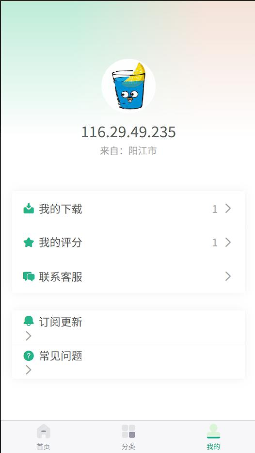

# wallora 壁纸应用

## 📱 功能特性

- 🎨 **精美壁纸** - 海量高质量壁纸资源
- 🔍 **智能搜索** - 关键词搜索、历史记录、热门推荐
- 📂 **分类浏览** - 多种主题分类，快速找到心仪壁纸
- 💾 **一键下载** - 支持壁纸下载和收藏
- ⭐ **评分系统** - 用户评分和推荐机制
- 📢 **公告系统** - 实时公告和活动通知
- 🔄 **跨平台** - 支持微信小程序、H5等多端运行
- 📤 **分享功能** - 支持分享到微信好友和朋友圈

## 🛠 技术栈

- **框架**: uni-app
- **前端**: Vue 3 + Composition API
- **样式**: SCSS
- **UI组件**: uni-ui
- **平台**: 微信小程序、H5
- **构建工具**: HBuilderX

## 🚀 快速开始

### 环境要求

- Node.js >= 14.0.0
- HBuilderX 或 微信开发者工具

### 安装运行

1. **克隆项目**
```bash
git clone https://github.com/Jaynxe/wallora.git
cd wallora
```

2. **运行项目**

**HBuilderX 方式：**
- 使用 HBuilderX 打开项目
- 点击运行 → 运行到浏览器 → Chrome

**微信小程序：**
- 使用微信开发者工具打开项目
- 导入项目，选择小程序项目


3. **构建发布**
```bash
# 构建微信小程序
npm run build:mp-weixin

# 构建H5
npm run build:h5
```

## 📁 项目结构

```
wallora/
├── api/                    # API 接口
│   └── apis.js            # 接口定义
├── components/             # 自定义组件
│   ├── common-title/      # 通用标题组件
│   ├── custom-nav-bar/    # 自定义导航栏
│   └── topic-item/        # 主题项目组件
├── pages/                  # 页面文件
│   ├── index/             # 首页
│   ├── category/          # 分类页
│   ├── search/            # 搜索页
│   ├── preview/           # 预览页
│   ├── user/              # 用户中心
│   └── notice/            # 公告页
├── static/                 # 静态资源
│   ├── images/            # 图片资源
│   └── tabBar/            # 底部导航图标
├── utils/                  # 工具类
│   ├── request.js         # 请求封装
│   ├── common.js          # 通用工具
│   └── system.js          # 系统工具
├── uni_modules/            # uni-app 插件
├── App.vue                # 应用入口
├── main.js                # 主入口
├── pages.json             # 页面配置
├── manifest.json          # 应用配置
└── uni.scss               # 全局样式
```

## 🎯 核心功能

### 首页模块
- 轮播图展示
- 公告滚动
- 每日推荐
- 专题精选

### 搜索功能
- 关键词搜索
- 搜索历史记录
- 热门搜索推荐
- 实时搜索结果

### 分类浏览
- 多种主题分类
- 网格布局展示
- 分类筛选功能

### 图片预览
- 高清图片预览
- 一键下载
- 用户评分
- 收藏功能

## 📱 界面预览
首页<br><br>


分类页面<br><br>


壁纸列表<br><br>


壁纸预览<br><br>


我的<br><br>


## 🔧 开发说明

### 开发规范
- 使用 Vue 3 Composition API
- 遵循 uni-app 开发规范
- 组件化开发，提高代码复用性
- 统一的代码风格和命名规范

### 性能优化
- 图片懒加载
- 数据分页加载
- 本地缓存机制
- 请求优化

